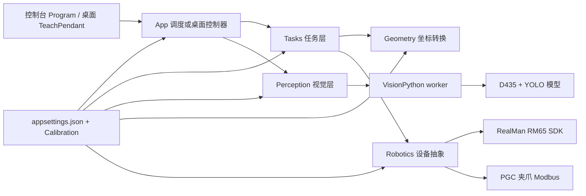

# Fruit_Pick_Part 项目通用说明

本文面向第一次接触本项目的开发者，说明项目入口、目录用途、主要文件职责、运行流程和修改位置。

> 项目同时包含两个程序：根目录下的控制台程序，以及 `TeachPendant/` 下的 Windows 桌面示教器。两者共用同一套机械臂、夹爪、视觉、坐标转换、任务和配置代码。

## 1. 项目整体结构

```text
Fruit_Pick_Part/
├── App/                 控制台程序的交互与任务调度
├── Calibration/         相机内参与手眼标定数据
├── Configuration/       appsettings.json 对应的强类型配置类
├── Geometry/            位姿、矩阵和相机点到机械臂 Base 的转换
├── Input/               键盘和 XInput 手柄读取
├── Interface/           夹爪底层寄存器通信抽象
├── Perception/          C# 视觉接口、检测结果和 Python worker 客户端
├── Robotics/            机械臂、夹爪接口及 RM65/PGC 实现
├── Tasks/               Far、Near、固定点位和放置任务
├── TeachPendant/        WinForms 桌面端、轨迹预览和工作空间显示
├── Vendor/              RealMan 厂商 SDK 与原生 DLL
├── VisionPython/        D435 取流、YOLO 推理和常驻视觉 worker
├── Program.cs           控制台程序入口
├── appsettings.json     设备、视觉和任务参数
└── FruitPickPart.csproj 控制台主工程定义
```

## 2. 两个程序入口

| 程序 | 入口 | 工程文件 | 用途 |
|---|---|---|---|
| 控制台程序 | [`Program.cs`](Program.cs) | [`FruitPickPart.csproj`](FruitPickPart.csproj) | 使用键盘或手柄控制设备，运行 Far、Near、固定点和完整采摘流程。启动时会按顺序连接机械臂、加载标定并创建视觉 worker。 |
| 桌面示教器 | [`TeachPendant/Program.cs`](TeachPendant/Program.cs) | [`TeachPendant/TeachPendant.csproj`](TeachPendant/TeachPendant.csproj) | 提供连接、点动、视觉、夹爪、自动任务、键盘/手柄远程控制、轨迹预览和工作空间扫描界面。启动页面本身不会自动操作真实设备。 |

两者的核心调用关系如下：



核心设计原则是：界面和任务层尽量依赖 `IRobot`、`IGripper`、`IPerception`、`ICoordinateTransformer` 等接口，而不是直接调用厂商 SDK。以后更换机械臂、夹爪或视觉实现时，可以尽量只替换底层实现。

## 3. 根目录文件

| 路径 | 作用 |
|---|---|
| [`.gitignore`](.gitignore) | 定义不提交到 GitHub 的文件，例如编译结果、Python 缓存、视觉输出、日志和模型权重。 |
| [`Program.cs`](Program.cs) | 控制台入口。读取配置，连接 RM65，创建夹爪、标定转换器、Python 视觉客户端和各项任务，最后进入 `ArmTestRunner.RunAsync`。 |
| [`FruitPickPart.csproj`](FruitPickPart.csproj) | 控制台工程配置。目标为 .NET 8、x86，并引用配置库和 XInput；同时把 `RM_Base.dll`、`appsettings.json` 复制到输出目录。它明确排除了 `TeachPendant/**/*.cs`，因此桌面代码不会被重复编入控制台程序。 |
| [`appsettings.json`](appsettings.json) | 当前实机配置中心。保存机械臂地址、Home 关节角、TCP 偏移、夹爪参数、相机、模型、标定路径、Far/Near 运动、固定点和放置点。修改后通常无需改 C# 代码。 |
| [`README.md`](README.md) | 项目阶段、操作按键、功能变化和历史修改记录。 |
| [`PROJECT_GUIDE.md`](PROJECT_GUIDE.md) | 本文档，负责解释目录、文件职责和代码调用关系。 |
| [`BASELINE.md`](BASELINE.md) | 算法与架构优化前的稳定基准、维护分支和补丁版本规则。 |
| [`启动桌面端.cmd`](启动桌面端.cmd) | 主目录下的一键启动入口。双击后直接打开桌面示教器；若 Release EXE 不存在，会先自动构建。 |

## 4. `App/`：控制台应用调度

| 文件 | 作用 |
|---|---|
| [`App/ArmTestRunner.cs`](App/ArmTestRunner.cs) | 控制台程序的总调度器。读取键盘/手柄输入，完成手动移动、Home、安全复位、急停、Far/Near 检测、固定点任务、Far/Near/Place 分阶段任务和连续自动采摘；还负责任务互斥、取消令牌和后台急停监听。 |

如果要修改控制台快捷键或控制台任务触发逻辑，通常从这个文件开始。

## 5. `Configuration/`：配置数据模型

该目录中的类与 `appsettings.json` 各节对应。类中是默认值和字段说明，真正运行值以 JSON 配置为准。

| 文件 | 对应配置及用途 |
|---|---|
| [`Configuration/RobotProfile.cs`](Configuration/RobotProfile.cs) | `RobotProfile`：RM65 型号、IP、端口、关节数、TCP 偏移、是否允许连接/运动和 Home 关节角。 |
| [`Configuration/GripperProfile.cs`](Configuration/GripperProfile.cs) | `GripperProfile`：夹爪类型、Modbus 端口、地址、波特率、速度、力度、开合位置和初始化策略。 |
| [`Configuration/CameraProfile.cs`](Configuration/CameraProfile.cs) | `CameraProfile`：D435 序列号、分辨率、帧率和相机内参文件路径。 |
| [`Configuration/HandEyeProfile.cs`](Configuration/HandEyeProfile.cs) | `HandEyeProfile`：手眼标定文件、eye-in-hand/eye-to-hand 模式和标定算法名称。 |
| [`Configuration/VisionModelProfile.cs`](Configuration/VisionModelProfile.cs) | `VisionModelProfile`：Far/Near YOLO 权重、置信度、图像 180° 翻转和调试画面设置。 |
| [`Configuration/TaskProfile.cs`](Configuration/TaskProfile.cs) | `TaskProfile` 与 `WaypointStep`：固定点任务的循环次数、位姿序列、速度和每个点位的夹爪动作。 |
| [`Configuration/FarApproachProfile.cs`](Configuration/FarApproachProfile.cs) | `FarApproachProfile`：Far 目标选择、靠近距离、速度、工具 XY→Z 分段、IK 预检查和姿态扰动策略。 |
| [`Configuration/NearPickProfile.cs`](Configuration/NearPickProfile.cs) | `NearPickProfile`：Near 目标选择、固定采摘姿态、果梗偏移、插入/撤离距离、夹爪参数、IK 和回 Home 策略。 |
| [`Configuration/PlaceProfile.cs`](Configuration/PlaceProfile.cs) | `PlaceProfile` 与 `PoseConfig`：框上方靠近点、框内放置点、撤离、开爪和回 Home 参数。 |
| [`Configuration/SelectionWeights.cs`](Configuration/SelectionWeights.cs) | `SelectionWeights`：YOLO 多目标选择时面积、距离和框上边缘位置的评分权重。 |

## 6. `Geometry/`：位姿与坐标转换

| 文件 | 作用 |
|---|---|
| [`Geometry/Pose3D.cs`](Geometry/Pose3D.cs) | 六维位姿值对象：`X/Y/Z` 为米，`Rx/Ry/Rz` 为弧度。 |
| [`Geometry/Transform3D.cs`](Geometry/Transform3D.cs) | 4×4 齐次变换矩阵；支持 ZYX 欧拉角建矩阵、矩阵相乘、点变换、求逆和从标定 JSON 读取矩阵。 |
| [`Geometry/ICoordinateTransformer.cs`](Geometry/ICoordinateTransformer.cs) | 图像点到机械臂 Base 坐标的抽象接口。 |
| [`Geometry/CameraToRobotTransformer.cs`](Geometry/CameraToRobotTransformer.cs) | 读取相机内参与手眼标定，把 `(u, v, depth)` 转换成 Base 坐标。eye-in-hand 模式会使用检测时刻的法兰位姿。 |
| [`Geometry/PoseUtils.cs`](Geometry/PoseUtils.cs) | 任务共用的位姿辅助算法，例如计算“只移动工具 XY”的中间位姿，以及限制 TCP 沿工具 Z 的最大前进距离。 |

坐标转换链为：图像像素与深度 → 相机三维坐标 → 手眼矩阵 → 法兰/Base 变换 → Base 下的目标点。

## 7. `Input/`：远程输入

| 文件 | 作用 |
|---|---|
| [`Input/JoystickInputReader.cs`](Input/JoystickInputReader.cs) | 使用 SharpDX XInput 寻找已连接手柄、读取按键/摇杆状态并做连接状态重置。控制台和桌面端都会使用。 |
| [`Input/KeyboardInputReader.cs`](Input/KeyboardInputReader.cs) | 使用 Win32 `GetAsyncKeyState` 读取全局物理键，并提供按下边沿检测；用于桌面程序不在前台时接收授权快捷键。 |

快捷键的实际动作映射分别位于 `ArmTestRunner.cs` 和 `TeachPendantForm.cs`，输入读取类本身不直接控制机械臂。

## 8. `Interface/`：底层传输接口

| 文件 | 作用 |
|---|---|
| [`Interface/IGripperRegisterTransport.cs`](Interface/IGripperRegisterTransport.cs) | 定义夹爪所需的 Modbus 寄存器连接、读写和释放操作，使 `PgcGripper` 不必直接依赖某一种机械臂 SDK。 |

## 9. `Perception/`：C# 视觉层

| 文件 | 作用 |
|---|---|
| [`Perception/IPerception.cs`](Perception/IPerception.cs) | 视觉抽象接口，定义单帧 Far/Near 检测。桌面实时预览能力由当前具体实现额外提供。 |
| [`Perception/DetectionResult.cs`](Perception/DetectionResult.cs) | 视觉数据对象：带深度的 `ImagePoint`、单个 `DetectedTarget`、Far/Near 检测结果，以及桌面预览帧事件。 |
| [`Perception/PythonWorkerPerception.cs`](Perception/PythonWorkerPerception.cs) | 启动和复用 `vision_worker.py`，通过标准输入/输出发送 JSON 命令；解析检测结果和 JPEG 预览帧；支持手动长时间 Far/Near 实时检测、主动取消、正常关闭和超时强制终止。 |

控制台和自动任务调用 `CaptureFarAsync`/`CaptureNearAsync` 获取截帧结果；桌面手动检测调用实时预览方法并订阅 `PreviewFrameReceived`，直到用户停止。

## 10. `Robotics/`：机械臂与夹爪

| 文件 | 作用 |
|---|---|
| [`Robotics/IRobot.cs`](Robotics/IRobot.cs) | 通用机械臂接口：连接、读取位姿/关节、关节运动、位姿运动和停止。 |
| [`Robotics/IStagedMotionRobot.cs`](Robotics/IStagedMotionRobot.cs) | 在 `IRobot` 上增加 IK 可达性检查，以及“先位置、后姿态”的分阶段运动。 |
| [`Robotics/MoveOptions.cs`](Robotics/MoveOptions.cs) | 运动参数与 `MoveMode`：速度、阻塞等待、关节位姿运动/直线运动、轨迹融合和直线失败回退策略。 |
| [`Robotics/Rm65Robot.cs`](Robotics/Rm65Robot.cs) | RM65 的真实实现。封装 RealMan SDK 的连接、状态读取、MoveJ、MoveJ_P、MoveL、IK 检查、分阶段运动和停止，并统一处理返回码、角度单位及连接状态。 |
| [`Robotics/IGripper.cs`](Robotics/IGripper.cs) | 通用夹爪接口：连接、初始化、打开、闭合和释放。 |
| [`Robotics/PgcGripper.cs`](Robotics/PgcGripper.cs) | PGC30060 夹爪实现。根据配置写寄存器完成初始化、速度/力度设置和开合。 |
| [`Robotics/Rm65ToolModbusTransport.cs`](Robotics/Rm65ToolModbusTransport.cs) | 使用 RM65 末端工具 Modbus 通道实现 `IGripperRegisterTransport`，供 `PgcGripper` 使用。 |

注意：关节角对外统一使用“度”，机械臂位姿中的欧拉角使用“弧度”；`Rm65Robot` 负责与 SDK 格式互转。

## 11. `Tasks/`：采摘业务流程

| 文件 | 作用 |
|---|---|
| [`Tasks/IPickTask.cs`](Tasks/IPickTask.cs) | 所有任务的统一接口；任务接收机器人、夹爪、视觉、坐标转换器、取消令牌和可选上下文。 |
| [`Tasks/PickTaskContext.cs`](Tasks/PickTaskContext.cs) | Far、Near、Place 之间传递状态：Far/Near 结果、Far 检测时法兰位姿、是否允许手动回退、严格自动模式、夹爪准备状态等。 |
| [`Tasks/FixedWaypointTask.cs`](Tasks/FixedWaypointTask.cs) | 按 `TaskProfile.Steps` 顺序移动到固定点，并在配置点执行开爪/闭爪。 |
| [`Tasks/FarApproachTask.cs`](Tasks/FarApproachTask.cs) | Far 粗定位：获取/复用 Far 检测 → 用检测时法兰位姿把 `top_center` 转到 Base → 计算预留安全距离后的目标 → 做 IK/分段处理 → 靠近并保存上下文。 |
| [`Tasks/NearPickTask.cs`](Tasks/NearPickTask.cs) | Near 精定位和采摘：检测或 Far 回退 → 偏差校验 → 计算果梗采摘点和固定姿态 → 安全靠近/插入 → 闭合夹爪 → 撤离 → 按配置回 Home。 |
| [`Tasks/PlaceTask.cs`](Tasks/PlaceTask.cs) | 放置：移动到框靠近点 → 框内点 → 打开夹爪 → 沿 Base Z 撤离 → 回 Home。 |
| [`Tasks/TaskAbortException.cs`](Tasks/TaskAbortException.cs) | 表示任务因检测、配置、可达性或安全前置条件不满足而主动中止，便于界面区分“任务失败”和普通程序异常。 |

完整自动任务的逻辑顺序为：

```text
执行前检查 → Home → Far 粗定位与靠近 → Near 精定位与采摘 → Place 放置 → 完成
```

## 12. `Calibration/`：标定数据

| 路径 | 作用 |
|---|---|
| [`Calibration/camera_intrinsics/`](Calibration/camera_intrinsics/) | 相机内参文件，包含焦距、主点等像素反投影所需参数。当前文件名带 D435 序列号和标定日期。 |
| [`Calibration/hand_eye/`](Calibration/hand_eye/) | 手眼标定结果，描述相机与机械臂末端或 Base 之间的空间变换。 |

更换相机、改变相机安装位置或重新标定后，应放入新的 JSON 文件，并同步修改 `appsettings.json` 中的相对路径。不要只改文件名而继续使用旧矩阵。

## 13. `VisionPython/`：D435 与 YOLO

| 文件或子目录 | 作用 |
|---|---|
| [`VisionPython/vision_worker.py`](VisionPython/vision_worker.py) | 常驻视觉进程。初始化 RealSense 和 YOLO，接收 `ping`、Far/Near 捕获、`cancel_capture`、`shutdown` 等 JSON 命令，返回检测数据及桌面用 JPEG 预览事件。自动任务只在找到可信目标时返回截帧；手动实时模式持续推理直到取消。 |
| [`VisionPython/capture_once_far_bbox_outputs.py`](VisionPython/capture_once_far_bbox_outputs.py) | Far bbox 推理与结果整理函数：深度采样、可信度判断、多目标评分、180° 坐标换算和输出格式化。也可作为独立单次检测脚本运行。 |
| [`VisionPython/capture_once_near_pose_line_outputs.py`](VisionPython/capture_once_near_pose_line_outputs.py) | Near 检测算法和结果整理。文件名保留早期 `pose_line` 命名，但当前 worker 的 Near 命令实际走 bbox 检测兼容路径。 |
| [`VisionPython/inspect_model.py`](VisionPython/inspect_model.py) | 独立模型检查工具；可选择图片或视频，运行 YOLO 并显示/保存标注效果，不参与正式自动任务。 |
| `VisionPython/models/` | 本机 YOLO `.pt/.onnx` 权重。被 `.gitignore` 排除，不会随普通 Git 推送上传。新电脑需要单独放置模型。 |
| `VisionPython/outputs/` | 调试图片、检测失败追踪等运行输出。被 Git 忽略，可按需清理。 |
| `VisionPython/__pycache__/` | Python 自动生成的字节码缓存，不需要维护或提交。 |

C# 与 Python 之间使用“一行一个 JSON 对象”的标准输入/输出协议。Python 的标准输出必须保持协议格式；普通调试信息应写到标准错误，否则会破坏 C# 解析。

## 14. `TeachPendant/`：桌面示教器

### 14.1 工程和主界面

| 文件 | 作用 |
|---|---|
| [`TeachPendant/TeachPendant.csproj`](TeachPendant/TeachPendant.csproj) | .NET 8 Windows 桌面工程，启用 WinForms 和 WPF、目标 x86，引用主工程并使用 HelixToolkit 显示 3D 模型。 |
| [`TeachPendant/Program.cs`](TeachPendant/Program.cs) | 桌面入口。寻找项目根目录和 `appsettings.json`，读取与控制台相同的配置并创建主窗体。 |
| [`TeachPendant/TeachPendantForm.cs`](TeachPendant/TeachPendantForm.cs) | 桌面程序主窗体和主要控制逻辑。包含设备连接、状态、手动点动、视觉与夹爪、自动任务、键盘/手柄权限、日志、参数显示、空间扫描和安全停止。设备和视觉采用按需创建，避免启动界面就操作实机。 |
| [`TeachPendant/GlobalUsings.cs`](TeachPendant/GlobalUsings.cs) | 桌面工程共用的全局 `System.IO` 引用。 |

`TeachPendantForm` 当前主要分页包括：手动控制、视觉与夹爪、自动任务、空间与轨迹、键盘控制、手柄控制、参数与诊断。

### 14.2 自动任务与阶段执行

| 文件 | 作用 |
|---|---|
| [`TeachPendant/VisualPickExecutionController.cs`](TeachPendant/VisualPickExecutionController.cs) | 桌面单次自动采摘协调器。检查机械臂/夹爪/视觉/标定条件，依次组织 Home、Far、Near、Place，并通过阶段事件把状态和耗时反馈给界面。 |
| [`TeachPendant/MotionStageExecutionController.cs`](TeachPendant/MotionStageExecutionController.cs) | “先规划、再确认、后执行”的阶段控制器。使用规划机器人/规划夹爪记录整个阶段的运动和夹爪命令，生成预览，获批后按原顺序在实机执行。 |
| [`TeachPendant/MotionPreviewRobot.cs`](TeachPendant/MotionPreviewRobot.cs) | 包装真实 `IRobot`。普通预览模式下先为单次运动生成轨迹并请求确认，再转发给真实机械臂。 |
| [`TeachPendant/MotionPreviewStartStateGuard.cs`](TeachPendant/MotionPreviewStartStateGuard.cs) | 执行预览轨迹前重新读取实机关节，确认机械臂没有在规划与执行之间被移动。 |
| [`TeachPendant/MotionPreviewExecutionVerifier.cs`](TeachPendant/MotionPreviewExecutionVerifier.cs) | 运动完成后比较实机关节/位姿与预览目标，超出容差时停止后续阶段并给出差异。 |

### 14.3 轨迹预览

| 文件 | 作用 |
|---|---|
| [`TeachPendant/MotionPreviewModels.cs`](TeachPendant/MotionPreviewModels.cs) | 轨迹预览的数据类型：预览种类、采样点、运动段、请求和批准服务接口。 |
| [`TeachPendant/Rm65MotionPreviewPlanner.cs`](TeachPendant/Rm65MotionPreviewPlanner.cs) | RM65 离线轨迹规划。生成关节或位姿插值采样，求解姿态/关节，并保持关节角连续，避免等价角跳变造成动画突然偏折。 |
| [`TeachPendant/MotionPreviewPoseMath.cs`](TeachPendant/MotionPreviewPoseMath.cs) | RealMan ZYX 欧拉角与四元数转换、姿态角距离计算，供插值和误差判断使用。 |
| [`TeachPendant/MotionPreviewApprovalService.cs`](TeachPendant/MotionPreviewApprovalService.cs) | 管理预览请求、用户批准/拒绝、执行中/完成状态和 UI 线程切换。 |
| [`TeachPendant/MotionPreviewForm.cs`](TeachPendant/MotionPreviewForm.cs) | 实际定义 `MotionPreviewControl`：显示 3D 机械臂、轨迹信息、动画进度以及确认/拒绝按钮。 |
| [`TeachPendant/Rm65UrdfScene.cs`](TeachPendant/Rm65UrdfScene.cs) | 读取 RM65 URDF 和 STL 网格，建立关节层级，并根据六轴关节角更新 3D 模型。 |

### 14.4 工作空间显示

| 文件 | 作用 |
|---|---|
| [`TeachPendant/ReachabilityMap.cs`](TeachPendant/ReachabilityMap.cs) | 保存三维网格每个采样点是否可达，并计算可达数量和边界。 |
| [`TeachPendant/WorkspaceMapControl.cs`](TeachPendant/WorkspaceMapControl.cs) | 绘制某一层的二维可达性网格和鼠标提示。 |
| [`TeachPendant/Workspace3DControl.cs`](TeachPendant/Workspace3DControl.cs) | 用 WinForms 绘制可旋转、缩放的三维工作空间点云。 |
| [`TeachPendant/WorkspaceMapForm.cs`](TeachPendant/WorkspaceMapForm.cs) | 独立工作空间窗口，组合过滤选项、二维视图和统计信息。 |

### 14.5 主题与控件

| 文件 | 作用 |
|---|---|
| [`TeachPendant/UiTheme.cs`](TeachPendant/UiTheme.cs) | 桌面颜色、字体及普通/执行/危险按钮、日志框和状态栏样式。 |
| [`TeachPendant/ThemeControls.cs`](TeachPendant/ThemeControls.cs) | 圆角绘制器、主题按钮、卡片分组框、分页控件和状态标签等自定义 WinForms 控件。 |

### 14.6 RM65 三维资源

| 路径 | 作用 |
|---|---|
| [`TeachPendant/Assets/RM65-B-V/urdf/RM65-B-V.urdf`](TeachPendant/Assets/RM65-B-V/urdf/RM65-B-V.urdf) | 机械臂连杆、关节轴、原点、限位和网格引用。轨迹预览模型以它为结构来源。 |
| [`TeachPendant/Assets/RM65-B-V/meshes/`](TeachPendant/Assets/RM65-B-V/meshes/) | Base 和六个连杆的 STL 外观网格。 |
| [`TeachPendant/Assets/RM65-B-V/MODEL_SOURCE.md`](TeachPendant/Assets/RM65-B-V/MODEL_SOURCE.md) | 三维模型的来源与使用说明。 |

## 15. `Vendor/`：厂商依赖

| 文件 | 作用 |
|---|---|
| [`Vendor/RealMan/ArmAPI.cs`](Vendor/RealMan/ArmAPI.cs) | RealMan 原生 SDK 的 C# P/Invoke 声明。它是厂商接口映射，不是项目业务逻辑。 |
| `Vendor/RealMan/x86/RM_Base.dll` | RealMan x86 原生运行库，程序连接和控制机械臂时加载。 |

除非升级 SDK 或确认厂商接口发生变化，否则不要直接修改 `ArmAPI.cs`。主程序和桌面工程必须保持 x86，才能加载当前 `RM_Base.dll`。

## 16. 自动生成或本地工具目录

| 路径 | 说明 |
|---|---|
| `bin/`、`obj/`、`TeachPendant/bin/`、`TeachPendant/obj/` | .NET 编译输出和中间文件；删除后可通过重新构建生成，不提交 Git。 |
| `.vscode/` | VS Code 本地编辑器配置；当前被 Git 忽略。 |
| `.claude/` | 本地 AI/工具配置；不属于程序运行逻辑，已被 Git 忽略。 |
| `.git/` | Git 仓库历史、分支和远程地址。不要手工修改其中内容。 |

## 17. 常见修改应该去哪里

| 想修改的内容 | 优先查看 |
|---|---|
| 机械臂 IP、Home、TCP 长度、速度和点位 | `appsettings.json` |
| Far/Near 目标选择和安全距离 | `appsettings.json`、`Configuration/`、`Tasks/FarApproachTask.cs`、`Tasks/NearPickTask.cs` |
| YOLO 推理、目标筛选、深度和图像翻转 | `VisionPython/` |
| C# 与 Python 通信、视觉停止、实时预览 | `Perception/PythonWorkerPerception.cs`、`VisionPython/vision_worker.py` |
| 桌面布局、按钮、日志、设备状态 | `TeachPendant/TeachPendantForm.cs`、`UiTheme.cs`、`ThemeControls.cs` |
| 自动任务阶段顺序 | `VisualPickExecutionController.cs` |
| 实机执行前整段预览 | `MotionStageExecutionController.cs` |
| 预览轨迹或末端关节动画 | `Rm65MotionPreviewPlanner.cs`、`MotionPreviewPoseMath.cs`、`Rm65UrdfScene.cs` |
| 控制台按键和手柄操作 | `App/ArmTestRunner.cs` |
| 桌面全局键盘/手柄权限和快捷键 | `Input/`、`TeachPendant/TeachPendantForm.cs` |
| RM65 SDK 指令封装 | `Robotics/Rm65Robot.cs`、`Rm65ToolModbusTransport.cs` |
| 夹爪开合行为 | `Robotics/PgcGripper.cs`、`Configuration/GripperProfile.cs` |
| 相机或手眼标定 | `Calibration/`、`CameraToRobotTransformer.cs`、`appsettings.json` |

## 18. 构建与运行

在项目根目录执行：

```powershell
# 构建控制台程序
dotnet build .\FruitPickPart.csproj -c Release

# 运行控制台程序（会按现有逻辑连接设备）
dotnet run --project .\FruitPickPart.csproj -c Release

# 构建桌面程序
dotnet build .\TeachPendant\TeachPendant.csproj -c Release

# 运行桌面程序（启动页面，但不会自动连接设备）
dotnet run --project .\TeachPendant\TeachPendant.csproj -c Release
```

正式连接实机前，应先核对 `appsettings.json`、相机/手眼标定文件、模型文件和机械臂工作空间。轨迹预览与软件停止是辅助保护，不能替代实体急停、限位、围栏和现场安全检查。
